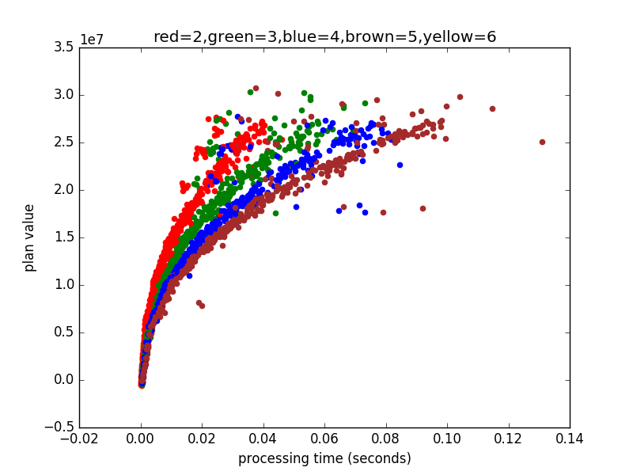

```{r setup, include=FALSE}
knitr::opts_chunk$set(echo = TRUE)
```

## Introduction

This report documents our study into Amstelhaege, a problem defined by the Heuristics course at VU Amsterdam January 2017.

### Activities

We have done the following:

 1. described the problem
 2. formulated heuristics
 3. described and implemented algorithms applying subsets of the heuristics
 4. compared implementations statistically
 5. plotted meaningful results in a readable way
 6. drew conclusions from data and suggested future work

### Research Question

How do different algorithmic components and variable affect plan value?

## Problem description

An amstelhaege problem instance is defined by a set of constraints for placement of rectangles in a continuous 2d area, and a function determining the area value.

### Value to optimize for

The sum of ( each tile's value + (clearance()-min clearance)*added value per one clearance unit), while satisfying problem instance constraints.

### Amstelhaege Constraints


      area_rules := width, height
      water_rules := max_waterbody_sides_len_ratio , max_num_waterbodies, minimum_water_proportion
      playground_rules := width, height, enable_playground, max_playground_distance, playground_cost
      residence_class := width, height, value, percent_increase_per_extra meter of clearance
      familyhome_rules := residence_class
      bungalow_rules := residence_class
      mansion_rules := residence_class
      residence_rules := number_of_residences, mansion_rules, bungalow_rules, familyhome_rules
      problem := area_rules, water_rules, playground_rules, residence_rules
      solution := residences, waterbodies, playgrounds

While there's an infinite number of possible problem isntances, the course defines 4 problem instances:

 - (main assignment) playground enabled, 2:3:5 ratio of residence types, [40,70,100] residences
 - (advanced assignment) playground disabled, any number of residences, any residence type proportion

While we focus on algorithms that work well within the course-defined constraints, it would be most elegant to design an algorithm which works well for any problem instance.

### Heuristics

We formulate these heuristics.

#### A : More clearance is better
More clearance directly increases the value of a residence. Naturally, we desire high clearance.

#### B : More valuable residences should be expanded first
When given a choice between increasing the clearance of a more or less valuable residence, chose the more valuable one.

#### C : Polite placement
A new residence should not be placed in a way that reduces an already placed residence’s clearance.

#### D : Clearance should be shared.
Dedicating area for clearance costs space. The cost effectiveness of clearancearea increases when it is shared.

#### E : Place residences in grids
Grids is the optimal way of distributing rectangles with maximal uniform distance.

#### F : Water out of the way
Place water in areas we wouldn't build on. This includes corners out of reach from playgrounds and the area within a residence's clearance.

#### G : Water last
When there is sufficient space, water should be placed last and adapt to other rectangles.
If G is fulfilled then F is also fulfilled.

#### H : Balanced playground placement
Playgrounds should be placed in a way that maximize area available for residences.

 - todo plot value for 2 pgs, 1 pg

### Algorithms

We implemented a series of algorithms with differing functionalities.
Some place only waterbodies and playgrounds and some place only residences.
Some place nothing on their own but optimize parameters for other algorithms.
In the following table, all our algorithms are listed with their features.
The rightmost columns reference heuristics used by the components.

#### Algorithm Components Table

 |name 			|  places wbs  | 	places pgs |	places residences   | opt params|A|B|C|D|E|F|G|H|
 |----------|--------------|-------------|-------------------|-----------------------|--|--|--|--|--|--|--|--|
 |base a 	|		1 |		1| 		||||||1|||
 |base b 		|	1 	|	1	|	||||||1|||
 |base c 		|	1| 		1	|	||||||1|||
 |tight fit a |	 		|	 |	1||||1|1|1||||
 |tight fit b |||	1||||1|1|1||||
 |hillclimber |||1||||||||||
 |simulated annealing||||1|||||||||
 |zoom||||1|||||||||
 |next|1|1|1|0|1|1|1|1|1|1|1|1|

#### Bases

Pictured are bases A, B and C.

```{r, out.width = "100px", echo=FALSE}
knitr::include_graphics("manual_images/base_a.png")


```

The bases were designed with heuristics F and H in mind, with the goal of maximizing playground area without spamming them, and placing waterbodies where playgrounds (mostly) can't reach. However heuristic G was not taken into account. Heuristic G implies bases should not place any water at all, water should instead be placed after residences.

#### Residence placers

##### Tight Fit

Tight Fit algorithms place residences on a base.
We implemented two versions: TightFitA and TightFitB.

Heuristics C,D,E were taken into account:

 - elements are placed in a grid
 - Clearance between residence types is uniform across residences of each type
 - Clearance values determined by seed values given to the algorithm upon init

They place residences as pictured.

```{r, out.width = "100px", echo=FALSE}


```

Tight Fit A (left) places one long wrapping line, while Tight Fit B (right) places three separate diagnoally cut grids.
We expect TF B's placement scheme to lead to less shared clearance, and thus for it to perform wors.

##### Hill Climber

HillClimber randomly generate N candidate moves, and selects the candidate with highest value. Results in plans as in the picture.
HillClimber uses no heuristics. However we expect its result plan to by convergence satisfy some constraints.
We expect Hill Climber to perform poorly.

##### Parameter Optimisers

The Tight Fit algorithm takes values at init which are used as the clearance for each residence type.
To find the best values to give Tight Fit, we implement algorithms that searches this 4d space (mansion clearance,bungalow clearance,familyhome clearance,value of generated plan) for the point with highest generated plan value.

In both our parameter optimisers, we could but don't apply heuristic B, by limiting the search space to where mansion_clearance/familyhome_clearance > 1.0

##### Simulated Annealing

Simulated Annealing (SA) is supposed to finds a good approximation of a global optimum, which in our context is a point in a 3D space which yields the highest plan value when input to a Tight Fit algorithm. The features of SA are in contrast with greedy algorithms such as hill climbing, which tend to get stuck
in local optima while often missing the global maximum when there are many peaks.

        Assign [i, j, k] with initial starting values
            For each iteration until max iterations:
            Randomly mutate the values, with decreasing level of mutation.
            The more iterations, the less likely to move to the new state even if it has a lower value than the current.
            Keep track of best state found.

##### Zoom

Zoom searches a 3D space with a certain range and interval for each dimension.
For every iteration over the search space, the algorithm ’zooms in’ around where
the best result was found.

        Search whole 3D space with a certain interval.
        Reset range to be around the best point found, and reduce the interval.
        When interval is below threshold, stop.

### Next algorithm

The next algorithm to implement would be one that uses all the heuristics.
We started to pack our heuristics into a new algorithm, but didn't have time to finish it.
For a demonstration of the implementation so for, run the presentation.py script in the attached code.

## Experimental setup

We run all implemented algorithms and catch the output value and computation time.
We also catch the value per time within algorithms, and the clearance parameters in cases where Tight Fit is involved.

### Results

#### Raw data

The raw data is attached in a spreadsheet and hosted in a sortable table at fanaly.site88.net/heur/

#### Plan value spread for each valuatation of each variant

```{r, out.width = "400px", echo=FALSE}
knitr::include_graphics("images/variants1.png")
```

```{r, out.width = "400px", echo=FALSE}
knitr::include_graphics("images/variants2.png")
```

 - Top left: all results where base=[A, B, C].
 - Top right: all results where residence placement function=[TFA,TFB,HC]
 - Bottom left: all results where number of candidate moves=[2,4,6]
 - bottom right: all restults where search function=[SA,Zoom]

We observe

 - bases A and C are generally better than B
 - TF A outperforms TF B
 - Considering more candidate moves increases HillClimber's plan values
 - Zoom finds better values than Simulated annealing
 - Our Hillclimbing implementation doesn't scale

#### Plan value per processing time

```{r, out.width = "220px", echo=FALSE}

knitr::include_graphics("images/TightFit_A-TightFit_B.png")


```

- upper left: Comparison of SA and Zoom
- upper right: Comparison of SA and Tight Fit
- lower left: Comparison of bases A, B, and C (aka dynamic)
- lower right: Comparison of HillClimber with [2, 3, 4, 5, 6] candidates

we observe

 - zoom slightly outperforms SA, but zoom spends more time searching but failing to improve
 - Tight Fit A outperforms Tight Fit B
 - in the first 3 plots, we can clearly distinguish between datapoints for different num house requirements
 - rainbow!

#### Correlations between residence clearances and plan value

We found these (pearson) correlations between plan value and each residence clearance factor, across all Tight Fit runs:

 - mansion clearance factor : 0.88,
 - bungalow clearance factor : 0.80,
 - familyhome clearance factor : 0.72.

todo:

 - scatterplot of correlation of each TF variant
 - catch average clearance factor of hillclimber and compare. convergence maybe?

#### Variety in algorithm output

 - TODO remove or regenerate with real data

```{r, out.width = "400px", echo=FALSE}

```

This boxplot shows spreads in plan value across several runs for the same problem instance.
As expected, deterministic algorithms have 0 spread.

### Best plans

```{r, out.width = "400px", echo=FALSE}

```

Above are the best plans found for 40, 70 and 100 residences.

|NH|Algo|Base|Residence placer|i|j|k|value|
|--|----|----|----------------|-|-|-|-----|
|40|Zoom|C   |TF A            |5.40|1.36|1.0|22.3 m|
|70|Zoom|C   |TF A            |2.35|2.65|2.62|32.7 m|
|100|Zoom|A   |TF A            |2.13|1.0|1.0|42.3 m|

We observe that the best algorithms happen to prioritize clearance of more valuable residences.
The 70-residence problem instance is an exception.
In this case, the similar clearances happen to allow tightfit to place the residences in a convenient way.
We also observe that tight fit A and zoom consistently outperform others.
Also note, crucially, that the best plans found have obvious ways of increasing clearance by moving and/or flipping some residences

## Conclusions

We described the problem, formulated heuristics, implemented some algorithms applying some of the heuristics,
set up a testing framework, and did some statistics and plotting on the data.
This helped us to identify the most suitable of our components.
The results indicate that search algorithms end up with finding plans that satisfy some of our constraints.
This shows both that these heurstics make sense,
    and that it's safe to include these heuritics in our implementation to restrict our search space.

Future work would involve to continue developing a cohesive algorithm which applies all heuristics. Parameter search for clearances should be avoided, as it takes a lot of time and could be better done for each grid individually, with expand, shrink and bounce functions. For data analysis, it would make algorithm component evaluation more fluent if we computed correlations across all columns. We've done this for a few numerical values, but it should be done systematically for all columns.

## Advanced assignment

For the advanced assignment the optimal number of residences is requested,
 or in other words the optimal plan configuration (still optimizing for value),
 when playgrounds, number of residence sum and proportions constraints are ignored.
For this purpose two static plans have been made, one for the situation with playgrounds,
 and one for a situation without playgrounds.
By manual deduction of the assignment a formula for value per square meter of space has been constructed,
 which can be applied for calculating the amount of value (V) per square meter for a residence
 
  - width W
  - height H
  - minimal clearance minC
  - clearance C, percentage per extra meter clearance as ppm and ns as number of sides.

The number of sides is reduced when sides of the residence are adjacent to water bodies or playgrounds as in those cases the clearance will not take up
space.

        V /m2 = (V + V * (minC - c) * ppm) / W + ns 1 * C ) * ( H + ns 2 * C )

This formula reveals that bungalows generate the most value per square meter,
    3325, when placed between water bodies at minimum distance.
Therefore, bungalows will be place between water bodies in the static plans to optimize for value.
On the other hand the family homes produce the highest value per square meter, 1979,
    when the clearance is at its minimum and calculated for ns = 2.
This meaning that placing as many family homes as possible would give the most value.
However, when filling the plan with as many family homes as possible,
    one can see that near the edge space is unused,
    because there is too little space to place more family homes as seen in the figure below.
This unused space causes a plan to lose potential value.
To make up for this the last row of family homes may be removed,
    and replaced by bungalows to allow for a more optimal use of space and generating
more value as seen in the second figure below.


```{r, out.width = "220px", echo=FALSE}


knitr::include_graphics("manual_images/advancedFamilyHome.png")

```

Family homes generate more value per square meter but this plan with bungalows generates a plan with more value, because more space is used. The balance between using as much family homes, which generate the most value per meter, and using enough other residences to optimize for space usage is difficult to find but may have been reached by the second plan that is presented. This second plan has a total of 197 residences of family homes and bungalows combined without the placement of playgrounds. Therefore one may say that the optimal number of residences is 197 in this case.
