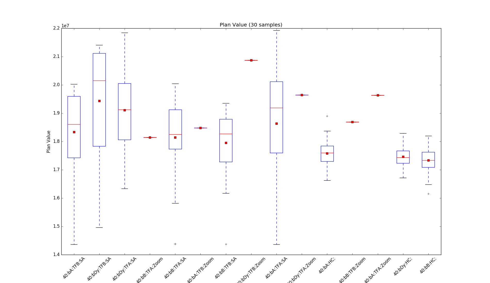

```{r setup, include=FALSE}
knitr::opts_chunk$set(echo = TRUE)
```

## Research Goals

 1. describe the problem
 2. formulate heuristics
 3. describe and implement algorithms applying subsets of the heuristics
 4. compare implementations algorithms statistically
 5. plot results in a human friendly and statistically sound way
 6. suggest best approach based on data

## Problem description

An amstelhaege problem instance is defined by a set of constraints for placement of rectangles in a continuous 2d area.
The course defines 4 such valuations, indicated in the table below.

### Value to Optimize

The sum of ( each tile's value + (clearance() - min clearance) x added value per one clearance unit), while satisfying problem instance constraints. 

### Amstelhaege Constraints


      area_rules := width, height
      water_rules := max_waterbody_sides_len_ratio , max_num_waterbodies, minimum_water_proportion
      playground_rules := width, height, enable_playground, max_playground_distance, playground_cost
      residence_class := width, height, value, percent_increase_per_extra meter of clearance
      familyhome_rules := residence_class
      bungalow_rules := residence_class
      mansion_rules := residence_class
      residence_rules := number_of_residences, mansion_rules, bungalow_rules, familyhome_rules
      problem := area_rules, water_rules, playground_rules, residence_rules
      solution := residences, waterbodies, playgrounds

### Heuristics

We formulate these heuristics.

#### A : More clearance is better

More clearance directly increases the value of a residence. Naturally, we desire high clearance.

#### B : More valuable residences should be expanded first

When given a choice between increasing the clearance of a more or less valuable residence, chose the more valuable one.

#### C : Polite placement

A new residence should not be placed in a way that reduces an already placed residence’s clearance.

#### D : Clearance should be shared.

Dedicating area for clearance costs space. The cost effectiveness of clearancearea increases when it is shared.

#### E : Place residences in grids

Grids is the optimal way of distributing rectangles with maximal uniform distance.

#### F : Adaptive Water

When possible, water should be placed after residences, within the largest unused areas.

#### G : Balanced playground placement

Playgrounds should be placed in a way that maximize area available for residences.
 - plot: value for 2 pgs, 1 pg

### Algorithms

We implemented a series of algorithms with differing functionalities.
Some place only waterbodies and playgrounds and some place only residences.
Some place nothing on their own but optimize parameters for other algorithms.
In the following table, all our algorithms are listed along with their categorization.

#### Algorithm Components Table

 |name 			|  places wbs  | 	places pgs |	places residences   | optimizes parameters|
 |----------|--------------|-------------|-------------------|-----------------------|
 |base a 	|		1 |		1| 		|
 |base b 		|	1 	|	1	|	|
 |base c 		|	1| 		1	|	|
 |tight fit a |	 		|	 |	1||
 |tight fit b |||	1||
 |hillclimber |||1||
 |simulated annealing||||1|
 |zoom||||1|
Bases are configurations of water and playground placements, ready to be used
by residence placement algorithms. We created two static bases and one dynamic base, which attempts to find an optimal solution for the given area and
constraints. Pictured are our three bases.

#### Bases

Pictured below are bases A, B and C (Dynamic):

```{r, out.width = "100px", echo=FALSE}

knitr::include_graphics("manual_images/base_b.png")
knitr::include_graphics("manual_images/base_c.png")
```

#### Residence placers

There are three residence placers.

##### Tight Fit

Tight Fit algorithms place residences on a base.
We implemented two versions: TightFitA and TightFitB.
Clearance between residence types is determined by seed values given to the Tight Fit algorithm upon init.
They place residences as pictured.
Hill Climber HillClimber randomly generate N candidate moves, and selects the candidate with highest value.
Results in plans as in the picture.

##### Parameter Optimisers

With uniform clearance for all residence types, we have a len(residence types)-
dimensional search space. We implement, use and compare two different search
methods for this task.

##### Simulated Annealing

Simulated Annealing (SA) is supposed to finds a good approximation of a global
optimum, which in our context is a point in a 3D space which yields the highest
plan value when input to a Tight Fit algorithm. The features of SA are in
contrast with greedy algorithms such as hill climbing, which tend to get stuck
in local optima while often missing the global maximum when there are many
peaks.

        Assign [i, j, k] with initial starting values
            For each iteration until max iterations:
            Randomly mutate the values, with decreasing level of mutation.
            The more iterations, the less likely to move to the new state even if it has a lower value than the current.
            Keep track of best state found.

##### Zoom

Zoom searches a 3D space with a certain range and interval for each dimension.
For every iteration over the search space, the algorithm ’zooms in’ around where
the best result was found.

        Search whole 3D space with a certain interval.
        Reset range to be around the best point found, and reduce the interval.
        When interval is below threshold, stop.

## Experimental setup


We run all plan generator algorithms and catch the output value and compu-
tation time. We also catch the value per iteration of algorithms where it is
applicable.

### Results

#### Raw data

The raw data is attached in a spreadsheet and hosted in a sortable table at fanaly.site88.net/heur/

#### Statistics

#### Plots

##### Plan value spread for each valuatation of each variant

Across whole dataset:

```{r, out.width = "300px", echo=FALSE}

```

- TODO replace with auto plot generation

```{r, out.width = "400px", echo=FALSE}

```

```{r, out.width = "400px", echo=FALSE}

```

 - Top left: varying bases A, B, C.
 - Top right: varying residence placer function TFA,TFB,HC
 - Bottom left: varying number of candidate moves 2,4,6
 - bottom right: varying search functinon (SA,Zoom)

We observe

 - bases A and C are generally better than B
 - TF A outperforms TF B
 - Considering more candidate moves increases HillClimber's plan values
 - Zoom finds better values than Simulated annealing
 - Our Hillclimbing implementation is not a scalable

#### Plan value per processing time

```{r, out.width = "220px", echo=FALSE}
knitr::include_graphics("images/SA-Zoom.png")

knitr::include_graphics("images/base_a-base_b-base_dynamic.png")
knitr::include_graphics("images/2-3-4-5-6.png")
```

- upper left: Comparison of SA and Zoom
- upper right: Comparison of SA and Tight Fit
- lower left: Comparison of bases A, B, and C (aka dynamic)
- lower right: Comparison of HillClimber with \[2, 3, 4, 5, 6\] candidates

we observe

 - zoom slightly outperforms SA, but zoom spends more time searching but failing to improve
 - Tight Fit A outperforms Tight Fit B
 - in the first 3 plots, we can clearly distinguish between datapoints for different num house requirements
 - ????
 - rainbow!

#### Correlations between each numerical variable and plan value

We found these (pearson) correlations between plan value and each residence clearance factor, across all data:

 - mansion clearance factor : 0.88,
 - bungalow clearance factor : 0.80,
 - familyhome clearance factor : 0.72.

todo:

 - plot change of correlations across algorithms
 - this would show convergence of high mansion clearance / plan value correlation toward those of sa and zoom

#### Variety in algorithm output

```{r, out.width = "500px", echo=FALSE}

```

 - Spread in plan value across 30 runs, with the same settings.
 - As expected, determininstic algorithms have 0 variance.

### Best plans

```{r, out.width = "100px", echo=FALSE}


```

Above are the best plans found for 40, 70 and 100 residences.

|NH|Algo|Base|Residence placer|i|j|k|value|
|--|----|----|----------------|-|-|-|-----|
|40|Zoom|C   |TF A            |5.40|1.36|1.0|22.3 m|
|70|Zoom|C   |TF A            |2.35|2.65|2.62|32.7 m|
|100|Zoom|A   |TF A            |2.13|1.0|1.0|42.3 m|

observations:

 - preference for more valuable residence
 - tight fit A and zoom consistently outperform others

## Conclusions

- see observations around doc

## Future work

- implement more of the heuristic knowledge

## Advanced assignment

For the advanced assignment the optimal number of residences is requested,
 or in other words the optimal plan configuration (still optimizing for value),
 when playgrounds, number of residence sum and proportions constraints are ignored.
For this purpose two static plans have been made, one for the situation with playgrounds,
 and one for a situation without playgrounds.
By manual deduction of the assignment a formula for value per square meter of space has been constructed,
 which can be applied for calculating the amount of value (V) per square meter for a residence
  - width W
  - height H
  - minimal clearance minC
  - clearance C, percentage per extra meter clearance as ppm and ns as number of sides.

The number of sides is reduced when sides of the residence are adjacent to water bodies or playgrounds as in those cases the clearance will not take up
space.

        V /m2 = (V + V * (minC - c) * ppm) / W + ns 1 * C ) * ( H + ns 2 * C )

This formula reveals that bungalows generate the most value per square meter,
    3325, when placed between water bodies at minimum distance.
Therefore, bungalows will be place between water bodies in the static plans to optimize for value.
On the other hand the family homes produce the highest value per square meter, 1979,
    when the clearance is at its minimum and calculated for ns = 2.
This meaning that placing as many family homes as possible would give the most value.
However, when filling the plan with as many family homes as possible,
    one can see that near the edge space is unused,
    because there is too little space to place more family homes.
This unused space causes a plan to lose potential value.
To make up for this the last row of family homes may be removed,
    and replaced by bungalows to allow for a more optimal use of space and generating
more value as seen in figure a below.


The above image shows a plan where space is used more optimally when using bungalows,
 instead of family homes to fill up the open space.

Figure 4: Advanced Assignment Plans

Homes generate more value per square meter this plan with bungalows generates a plan with more value,
 because more space is used.
Plan B, the plan with the most optimal value, has a total of 197 residences when no playgrounds are placed.
Using more family homes might increase value if the amount of space used does not decrease.

Future work
Bringing together our heuristics
Our best plan values took 10 seconds to generate. This is a lot of time, and there’s obvious room for improvement.
